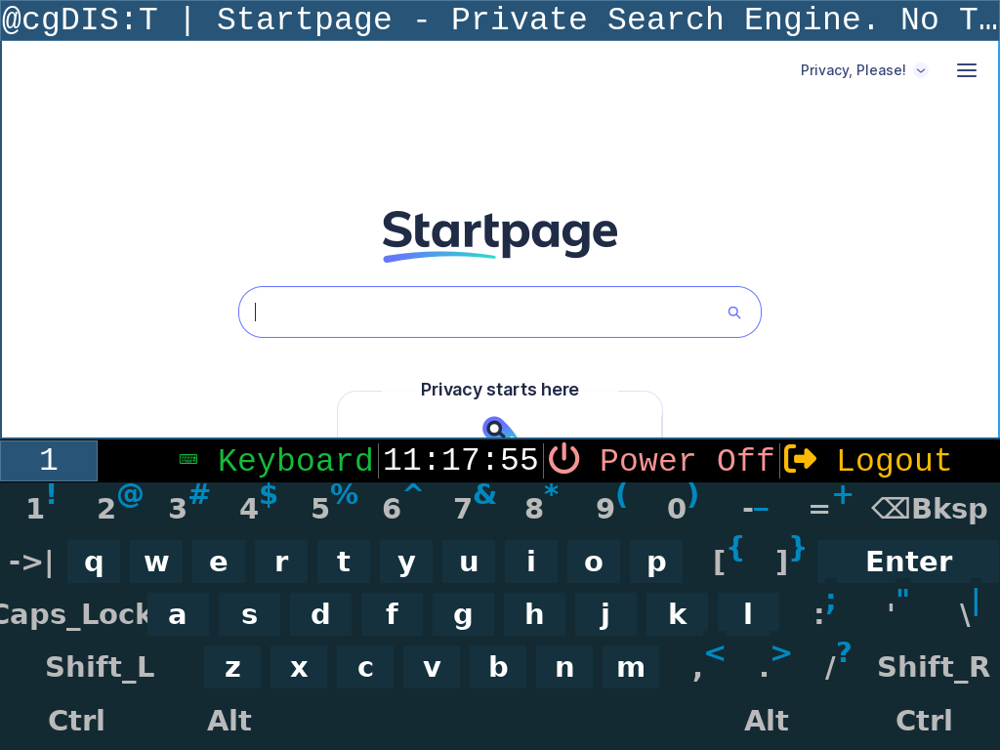
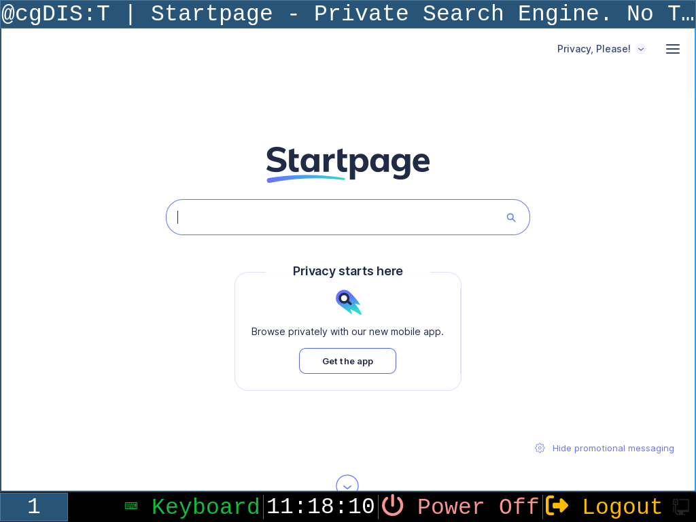
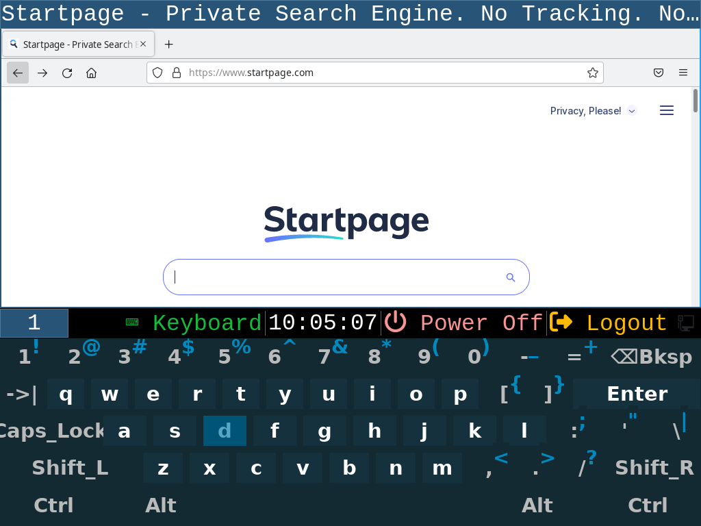

# Simple HMI Running a Web Browser With i3

The simple HMI setup, where control is performed exclusively through the web browser for a touch-screen-equipped x86 industrial PC ...

## Properties
  * Simple and lightweight setup under X
  * The touchscreen allows: web browser control, use and toggle virtual keyboard, Shutdown, Logout
  * Virtual keyboard allows almost no interaction with i3 except control of the browser window
  * When the physical keyboard is connected, one has a full-fat Slackware system with i3 controls available immediately

## Requirements
  * [surf](https://surf.suckless.org/), [slackbuild](http://slackbuilds.org/repository/15.0/network/surf/)
  * [Firefox ESR](https://www.mozilla.org/firefox/) from [Slackware](http://slackware.com)
  * [SDDM](https://github.com/sddm/sddm/) from [Slackware](http://slackware.com)
  * [i3](https://www.i3wm.org/), [slackbuild](http://slackbuilds.org/repository/15.0/desktop/i3/)
  * [i3status](https://i3wm.org/i3status/), [slackbuild](http://slackbuilds.org/repository/15.0/desktop/i3status/)
  * [i3blocks](http://vivien.github.io/i3blocks/), [slackbuild](http://slackbuilds.org/repository/15.0/desktop/i3blocks/)
  * [svkbd](https://tools.suckless.org/x/svkbd/), [slackbuild](http://slackbuilds.org/repository/15.0/accessibility/svkbd/)

### Note
This setup was tested on the standalone Slackware 15.0 with packages build using the slackbuilds.org i3-related build-script, with versions at the date of build [2024-12-30].

## System Setup
  * Slackware starts to init level 4
  * The hmi user was created
  * SDDM was configured to auto-login
  * The simple [firewall](rc.firewall) is used

## i3 Setup
  * The default i3 [setup](config/i3/) is used with minor adjustments
  * The web browser (surf or Firefox) is started automatically
  * The svkbd virtual keyboard can be started automatically (see the end of the [config](config/i3/config))

### Note
When the svkbd is killed and started again, the current window must be re-focused to accept input.
The simple workaround is prepared in the keyboard toggle script.
  
### i3 Bar Setup
  * [setup](config/i3blocks/) is used to bring basic info (time), a keyboard toggle button, and Logout and PowerOff buttons
  * See the [config](config/i3blocks/config) file
  * The [keyboard](config/i3blocks/keyboard) script is used to toggle the virtual keyboard

## Firefox Setup
  * Create an extra profile just for an HMI web application
  * When starting Firefox, run empty profile and disable restore-session

